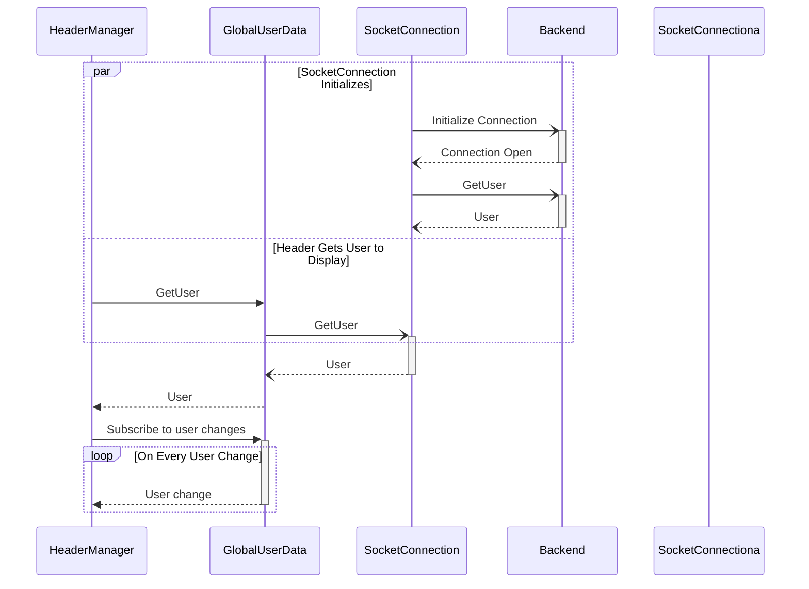
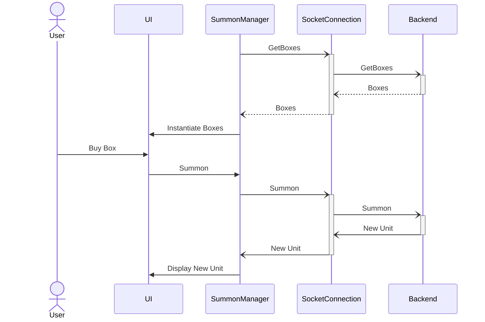

# Champions of Mirra


## Table of Contents

- [Champions of Mirra](#champions-of-mirra)
  - [Table of Contents](#table-of-contents)
  - [About](#about)
  - [Licensing](#licensing)
  - [Requirements](#requirements)
    - [Unity Setup](#unity-setup)
  - [Suggested Development Environment](#suggested-development-environment)
  - [Useful Commands](#useful-commands)
  - [Contact and Socials](#contact-and-socials)

## About

Welcome to the realm of Champions of Mirra, crafted by LambdaClass.

Champions of Mirra is the second game that utilizes our groundbreaking [Game Backend](https://github.com/lambdaclass/game_backend). This open-source backend, meticulously developed by Lambda, ensures seamless and reliable gameplay.

Step into a universe where you, the player, get to turn the tides on an all-out war between the forces of good and evil. Side together with Mirra, the capricious deity known for manipulating entire societies by exploiting their deepest desires, or choose to rebel against its advances instead.

Champions of Mirra is more than a game; it's an adventure into a world where strategy, skill, and a dash of chaos converge. Join the battle and confront the challenges that lie ahead in this captivating and dynamic gaming experience. The stage is set, and the Champions of Kaline await your commands—embrace the challenge and become a legend!


## Licensing

The code is licensed under the Apache 2 license, while the music and graphics are licensed under a CC attribution and share-alike license.

Find our open-source 3D models, concept art, music, lore, and more in our [Curse of Mirra Open Game Assets](https://github.com/lambdaclass/curse_of_myrra_assets) repository.

## Requirements

Ensure you have the following dependencies installed:

- **Nix:**
You can install the Nix package manager by running the following command in your terminal:
```bash
$ curl \
  --proto '=https' \
  --tlsv1.2 \
  -sSf \
  -L https://install.determinate.systems/nix \
  | sh -s -- install
```
The installer will ask you for the sudo password, and then print the details about what steps it will perform to install Nix. You have to accept this to proceed with the installation.

Make sure there weren't any errors during the installation and, if there are none, close the shell and start a new one.

To test if Nix generally works, just run GNU hello or any other package:
```bash
$ nix run nixpkgs#hello
Hello, world!
```

For a more detailed explanation, visit the [Nixcademy installation guide](https://nixcademy.com/2024/01/15/nix-on-macos/).

- **Unity:**
  - [Download Unity](https://unity.com/unity-hub)
  - Download the following Unity Store assets 
    - [RPG & MMO UI 6](https://assetstore.unity.com/packages/2d/gui/rpg-mmo-ui-6-99450)
    - [Map Maker](https://assetstore.unity.com/packages/2d/environments/map-maker-249063)
    - [RPG inventory icons](https://assetstore.unity.com/packages/2d/gui/icons/rpg-inventory-icons-56687#version-current)
    - [Basic RPG Icons](https://assetstore.unity.com/packages/2d/gui/icons/basic-rpg-icons-181301)
    - [Resource Vector Graphics](https://assetstore.unity.com/packages/2d/gui/icons/resource-icons-101998)
    - [DOTween](https://assetstore.unity.com/packages/tools/animation/dotween-hotween-v2-27676)
    - [Gold Mining Game](https://assetstore.unity.com/packages/2d/gui/gold-mining-game-2d-mine-ui-tilset-263856)
    - [UX Flat Icons](https://assetstore.unity.com/packages/2d/gui/icons/ux-flat-icons-free-202525)
    - Import the necessary TextMeshPro assets by going to:
      - "Window -> TextMeshPro -> Import TMP Essential Resources" and
      - "Window -> TextMeshPro -> Import TMP Examples and Extras"

### Unity Setup

- In Unity Hub, click on the add project button and select the `client` folder.
- Choose the correct editor version and download the [Top Down Engine](https://assetstore.unity.com/packages/templates/systems/topdown-engine-89636) by [More Mountains](https://moremountains.com). Include it in the `Assets/ThirdParty` folder after purchasing the license.
- To test the game, select the scene in `Assets/Scenes/Overworld` and run it by clicking the play button.

## Suggested Development Environment

Set up your environment with the following steps:

- Download the [.NET SDK](https://dotnet.microsoft.com/es-es/download/dotnet/thank-you/sdk-7.0.403-macos-arm64-installer) for your operating system.
- In VSCode, download the .NET extension. After installation, change the version to 1.26 (locate the version dropdown next to the Uninstall button in the extension window).
- To check if the setup is successful, go to VSCode's console, select the Output tab, and pick Omnisharp Log in the dropdown. If there are no error logs and Omnisharp is scanning the project, the configuration is correct.

## Useful Commands

```bash
make tests
```

## Contact and Socials

If you have any questions, feedback, or comments:

- **Email:** gamedev@lambdaclass.com

We share our development and creative process in the open, follow us for frequent updates on our game:

- **Twitter:** [@CurseOfMirra](https://twitter.com/curseofmirra)
- **Reddit:** [r/curseofmirra](https://www.reddit.com/r/curseofmirra/)
- **Discord:** [join link](https://discord.gg/hxDRsbCpzC)
- **Telegram:** [t.me/curseofmirra](https://t.me/curseofmirra)




