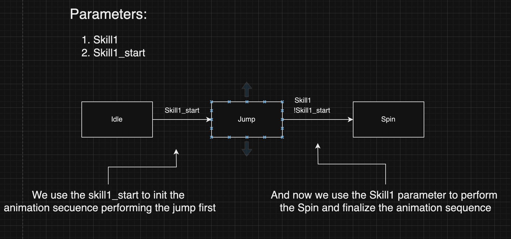
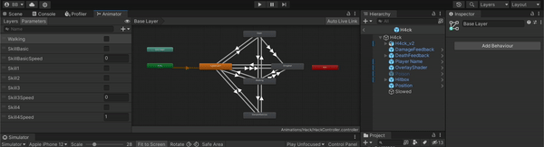

# Unity Animations

## Quick overview

#### The animator

The animator is the interface to control the [Animation System Overview](https://docs.unity3d.com/Manual/AnimationOverview.html). We use it to add the animations and create a flow within them.

#### Animation

The animation component is used to play animation clips, which are movement keyframes of the object we want to animate.

#### Transitions

Animation transitions allow the state machine to switch or blend from one animation state to another. We can use different parameters to make a transition happen. Such as booleans, floats, etc.

Transitions have different settings to setup depending on what you want, these are the most important.

- Has Exit Time: Determines a fixed time for an animation. Ignores any kind of transition parameter.
- If the Fixed Duration box is checked, the transition time is interpreted in seconds. If the Fixed Duration box is not checked, the transition time is interpreted as a fraction of the normalized time of the source state.
- Transition duration: This determines how much will it take to transition to the next state.

We need the Animator, animations, and transitions to create solid animations with correct flow and states. Drag the animations inside the animator and create a transition (right-click in the state) between them to start using your animations.

## How we handle animations

### Parameters

We use a specific list of parameters for our transitions

- `SkillBasic, Skill1, Skill2, Skill3, Skill4 (Booleans)` We use them to change the state of the animation and make the transition happen.

- `SkillBasic_start, Skill1c_start, Skill2c_start, Skill3c_start, Skill4c_start (Booleans)` Not always necessary, we use them to concatenate animations. For example, if a skill has two different animations that happen sequentially and we want to concatenate them to create the whole animation we can do something like this:

- `SkillBasicSpeed, Skill1Speed, Skill2Speed, Skill3Speed, Skill4Speed (Floats)` We use them to control the speed of the animation. To use them you have to set the animation to use the multiplier parameter and choose the respective parameter.

- `SkillBasicSpeed_start, Skill1Speed_start, Skill2Speed_start, Skill3Speed_start, Skill4Speed_start (Floats)` We use them to control the speed of the animation start. To use them you have to set the animation to use the multiplier parameter and choose the respective parameter.

### Scripts

Let's dive into how we use the animations to match with our backend, the scripts we use and more. The main scripts that participate in the animation flow are:

- `Skillinfo.cs` a ScriptableObject with the skill information, here what we care about are the fields `hasModelAnimation`, `startAnimationDuration`, `executeAnimationDuration`, and `animationSpeedMultiplier` fields. We'll talk about them later, so keep them in mind.

- `Skill.cs` This is a really important script, here we control the complete flow of the animations (Play, Stop, Block movements, etc)

- `SkillAnimationEvents.cs` is in charge of changing the active skill playing and end the animation playing.
- `Battle.cs` Depending on the backend action, executes the corresponding skill and starts the flow of the animation system.
- `CustomLevelManager.cs` Where the buttons are mapped with the respective skill.

### SkillInfo fields

- `startAnimationDuration`: (``float``) and `executeAnimationDuration`: (``float``) These methods represent the maximum duration time to eject the skill animation

- `animationSpeedMultiplier`: (``float``) Determine the play speed of the animation (used in the transition parameters if it is set).

### Skill.cs

In this script is where all the skill-animation flows happen. It has all the scripts to start, execute, stop, and change the animations. Check the documentation to read more: [Skill docs](./skill.md).
