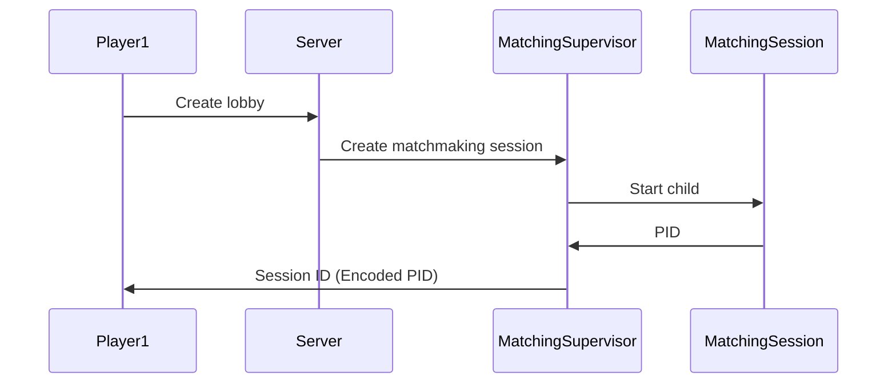
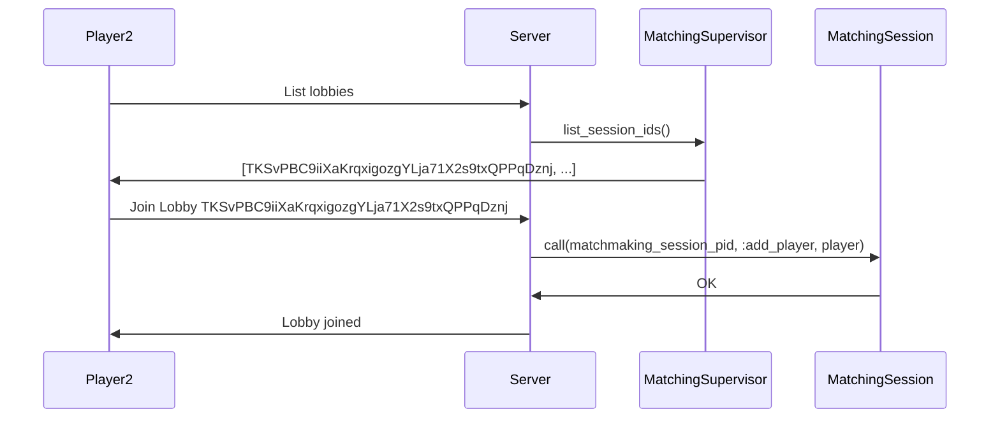
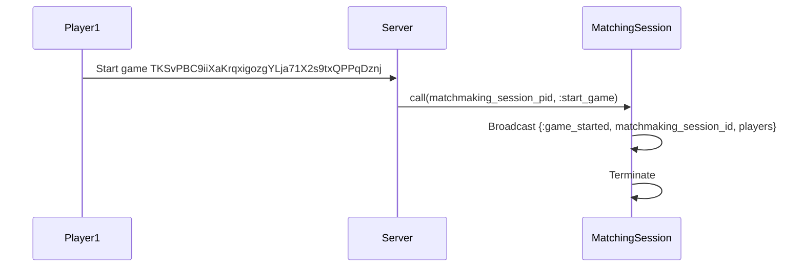
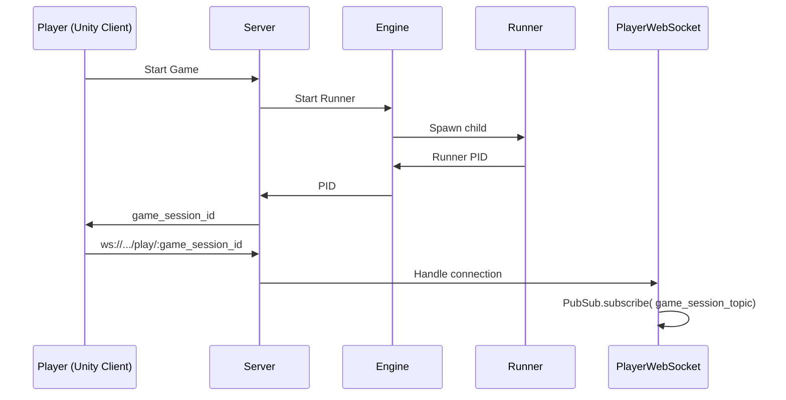
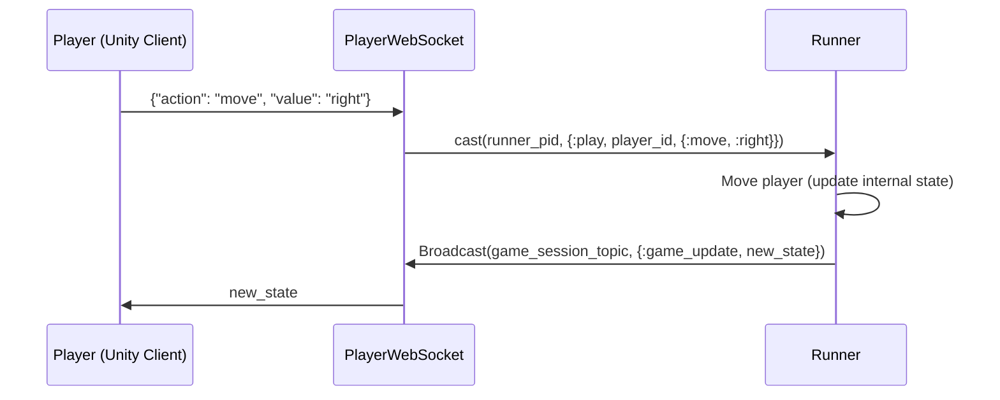

# Backend Architecture

In this document we go over how the backend is structured. Currently, it serves two related but distinct purposes:

- It provides a matchmaking functionality, where players join lobbies with other players hoping to start a game or create their own so others can join.
- Once a game starts, it acts as the authoritative server for it. It receives players' actions, updates the game state according to the rules of the game, then sends it back to players. We'll call this the *gameplay* functionality.

## Matchmaking

For matchmaking to work, players should be able to:

- Create their own lobbies.
- View a list of current lobbies and join any of them.
- Send a link to other players to join their lobby.
- Start the game once the lobby is full or they just want to start early.

All matchmaking sessions are spawned by a `DynamicSupervisor` called `MatchingSupervisor`. When a player creates a lobby, this supervisor starts a new child `MatchingSession` process. This is the process that will both handle the logic and hold all of the state for that lobby. Right now, that's just a list of the current players in the lobby, along with the ability to add/remove players and start the game.

Inside a lobby, when a player decides to start the game, the lobby process uses [Phoenix PubSub](https://hexdocs.pm/phoenix_pubsub/Phoenix.PubSub.html) to broadcast a message saying that the game has started; then it terminates. We'll go into it later, but the idea is that the *gameplay* part of the server will pick up this message and start the game from there.

Every lobby has a unique `ID`, which we call the `session_id` throughout the code. This id is simply the erlang `PID` of the lobby process with an encoding on top to make it human readable. This way players can pass it around to their friends to join their lobbies.

### Create lobby



### Join game



### Start game



## Gameplay

When a game starts, two things happen:

- A game session is spawned by a `DynamicSupervisor` called `Engine`.  This `Engine` starts a new child `Runner` process, which holds the entire game's state and the logic to update it according to the players' actions. The PID of this `Runner` is encoded in a human friendly format and called the `game_session_id`.
- Every player connects to the game through websocket under the `/play/:game_session_id` path. Each player's connection is handled by a separate [cowboy websocket](https://ninenines.eu/docs/en/cowboy/2.6/manual/cowboy_websocket/) process, defined in the `PlayWebSocket` module. On startup, the process saves the runner's PID so it can communicate with it. Inside the game, a player is the same as a websocket connection.

Let's go over the main gameplay flow. Let's say `player_1` wants to move to the right one square. To do this, they send a `JSON` frame over the socket that looks like this:

```json
{"action": "move", "value": "right"}
```

The corresponding `PlayWebSocket` process picks it up, decodes it, then sends a message to the `Runner` with the player's action like this:

```elixir
GenServer.cast(runner_pid, {:play, player_id, action})
```

The `Runner`'s appropriate handler eventually picks up this message, which in this case looks like this:

```elixir
  def handle_cast(
        {:play, player, %ActionOk{action: :move, value: value}},
        %{next_state: %{game: game} = next_state} = state
      ) do
    game =
      game
      |> Game.move_player(player, value)

    next_state = Map.put(next_state, :game, game)

    state = Map.put(state, :next_state, next_state)

    {:noreply, state}
  end
```

Every action handler essentially does those two things: update the game state accordingly, then broadcast a message with the newly updated state. 
We're managing game updates through a tick rate. Updates are being sent
every 30ms.

You'll notice the `init` function on the `PlayWebSocket` process does (among other things) the following:

```elixir
:ok = Phoenix.PubSub.subscribe(DarkWorldsServer.PubSub, "game_play_#{game_id}")
```

This allows the socket processes to receive state updates they can then relay to the player.

Below are two diagrams summarizing the whole flow.

### New Game



### Gameplay



# Comments/Omissions

## State management and Rust NIFs

In the architecture walkthrough above, we glossed over how the game state is handled. Currently, it consists of two things:

- A list of players, each of which has an `id`, a position, and a health value.
- A `board`, which is just a matrix indicating what each cell on the map contains (whether it's empty, has a player in it, etc).

This state is kept inside the `Runner` process, but *state transitions* (players moving, attacking, etc) are computed in Rust. To call Rust code from Elixir we use [Rustler](https://github.com/rusterlium/rustler), which allows us to write `NIF`s; a way to call low level performant code inside the Erlang VM. You can read more about them [here](https://www.erlang.org/doc/tutorial/nif.html) and [here](https://www.erlang.org/doc/man/erl_nif.html).

All the Rust game state code is located inside the `native/gamestate` directory. The functions exposed to Elixir are all in the `lib.rs` file. Here's the function that we call to move players around the map:

```rust
#[rustler::nif(schedule = "DirtyCpu")]
fn move_player(game: GameState, player_id: u64, direction: Direction) -> GameState {
    let mut game_2 = game;
    game_2.move_player(player_id, direction);
    game_2
}
```

The associated Elixir function is inside the `Engine.Game` module:

```elixir
def move_player(_a, _b, _c), do: :erlang.nif_error(:nif_not_loaded)
```

The magic that makes this call Rust underneath is all inside this `use` declaration

```elixir
use Rustler, otp_app: :dark_worlds_server, crate: "gamestate"
```

Every Rust Struct has a corresponding Elixir struct that it maps to; calling the Elixir functions is transparent to someone using the API.
