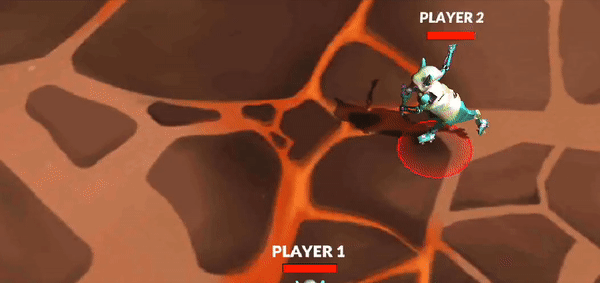

# Fluid Gameplay in an Online Environment

Curse of Mirra is a multiplayer game. As such, every action any player performs (moving, attacking, etc) has to go through a centralized server that changes the state accordingly and sends back the new state to players. This introduces a huge source of problems when trying to render the game smoothly: there is an unreliable network in between.

Here we'll go over the problems that arise from networking, how we solved some of them, and how we might improve these solutions in the future. The way we judge whether we have done a good job or not is if the game feels good to play. Ultimately, that's the only metric that matters here.

The main thing we will discuss is *movement*, as it is the most basic element of the game that needs to render smoothly. Constant jitters/stutters in movement are the hallmark of code that is not robust enough to handle multiplayer gameplay.

Most of the ideas presented here are not new.

We recommend reading the articles below for an introduction to common problems caused by latency, standard solutions like client prediction and interpolation and examples of implementations, which will aid in understanding our specific implementation.

- [Gabriel Gambetta's Series on Client-Server Game Architecture](https://www.gabrielgambetta.com/client-server-game-architecture.html)
- [Valve's article on Source multiplayer networking](https://developer.valvesoftware.com/wiki/Source_Multiplayer_Networking)
- [Valve's article on Latency Compensating methods](https://developer.valvesoftware.com/wiki/Latency_Compensating_Methods_in_Client/Server_In-game_Protocol_Design_and_Optimization)

## Framerate, Tick rate and Action rate

Before continuing, we need to talk about three very important concepts.

### Framerate

`Framerate`, sometimes called `FPS` (for `frames per second`), is how many `frames` the game (Unity) renders each second. Let's go into this in more detail. As complex as games can be, they can all ultimately be reduced to the following high level code:
```
while true {
    get_user_inputs();
    update_game_state_according_to_these_inputs();
    render_game_state();
}
```

This mental model is so common in games that it has a name; this is the `game loop`. A `frame` is the result of one iteration of this loop. In multiplayer games, such as ours, this loop looks slightly different: clients are not the ones updating game state, they get those updates from the server. The general idea still applies however.
 
Typically, the more computing power you have, the higher your framerate. In Mirra, we show players their framerate in the bottom of the screen. Its value is usually capped at `300`, and anything below `30` will feel really bad to play. Most games run either at `30`, `60` or at an uncapped `FPS` rate.

Mirra does not cap framerate, which means it can go beyond `300` (although you won't be able to see this in Unity, because it doesn't show FPS numbers higher than `300`). This is an important thing to keep in mind, as we don't have control over it, and therefore cannot make assumptions about its value. Some games cap it and then use it as a way to, for example, keep track of time.

It's very important to understand that framerate is a property of the client; the server does not know about it at all. This will matter later on.

### Tick Rate

The `Tick Rate` is the rate at which the server sends game updates to every client. As explained on the [backend architecture section](./backend_architecture.md), the way our backend works is the following:

- It receives commands from clients (move, attack, use ability, etc).
- Commands are applied to the game state, mutating it.
- Every so often, it sends every client the current game state.

This last "every so often" is the tick rate. We usually refer to it in milliseconds, so if we say the tick rate is `50ms`, what we are saying is every 50 milliseconds, the backend will send the current state to clients.

You can think of tick rate as the rate at which the client samples the gameplay. A higher tick rate means the client samples more frequently, and thus converge to a more continuous experience, while a lower one can make the game look like a slideshow.

Note that in our design the tick rate is the same for every player, that is, players all receive updates at the same rate. This is not the only way to do things. `Valve`, for example, makes it possible for the player to set (within a range) how many ticks they get per second. Typically, players want to set it as high as possible for a more accurate experience, but if the network or computer can't handle a high tick rate, lowering it can help.

### Action/Command Rate

The `Action` or `Command` rate is the rate at which the client sends movement commands to the server. It's important to understand that this applies ONLY to movement. Commands related to using abilities do not have this restriction, and can be sent in any moment, at any frequency. This is an unusual choice. The way we handle input in general is unusual, so let's explain it in more detail.

Usually, the main reason to introduce an action rate is to reduce pressure on the network, both on the server and the client. The standard way to do this is:

- Whenever the player performs a movement or action, it is saved into a list/buffer.
- When the action rate time has passed, the client bundles up all the commands and sends them together to the server.

We don't do this. What we do instead is the following:

- For non-movement commands, whenever the player issues them, we immediately send the command to the server.
- For movement commands, every `ActionRate` milliseconds, we check for input on the movement keys/joystick. We then send the appropriate command to the server (move left, move right, etc).

The reason we do this has nothing to do with reducing pressure on the network. It's a consequence of what movement commands look like in our game. When someone sends a "move right" command, the server will move them a fixed amount to the right. If players were able to send more than one "move right" command in one ActionRate unit, they'd move faster the more they sent. This is a problem, which we fixed in the hackiest way possible. We introduced the action rate to fix the move commands frequency, and thus fix movement speeds.

Keep in mind this isn't final. We may and probably will change this at some point in the future. For now, however, this is how it works. Of course, people could cheat by unlocking their action rate, which is something we will have to address if this is the solution we keep.

The less hacky solution to this is to make `move` commands tell the server where you are now. Clients know their character speed so they can do the math themselves and just tell the server "now the character is here" or "the character moved this many units to the right". This allows clients to send as many position updates as they want. You still have to prevent cheating, however, by having the server check if the new position is valid under the game rules, but we won't concern ourselves with that here.

In Mirra, the action rate is set to be the same as the tick rate. This way, we get one movement command per tick. The immediate problem caused by this is that game speed is tied to tick rate. Decreasing tick rate slows everything down, increasing it accelerates it. There's also another huge problem this causes, which we'll talk about extensively later on as it affects smooth movement.

### Implementation

We found that there were times where the interpolation ghosts [see below: Ghost] differed too way much from the server. After a bit of research, we discovered that the problem had to do with using the [`Time.deltaTime`](https://docs.unity3d.com/ScriptReference/Time-deltaTime.html) that belongs to Unity. That amount of time is how much time has passed since the last frame to the current one. That sounds okay, but the problem is that the game editor/Android build/iOS build should be active in the screen, if you change tabs or let the game run in the background the `Time.DeltaTime` stops but the server doesn't and because of that all the operations get messed up. In order to solve this, we just changed it for Unix time in milliseconds.

```csharp
    if (firstTimestamp == 0)
    {
        firstTimestamp = DateTimeOffset.UtcNow.ToUnixTimeMilliseconds();
    }
    var currentTimestamp = DateTimeOffset.UtcNow.ToUnixTimeMilliseconds();
    accumulatedTime = (currentTimestamp - firstTimestamp);
```

And now that we detached the time from Unity, at the moment, everything works as intended.


## Networks are unreliable

There are two main problems we are trying to prevent. They are:

- *Input lag*: Players feel a delay between when they press a button and when the corresponding action happens in-game.
- *Choppy movement*: Character movement does not look fluid. Sometimes movement stops in-place and then starts again, when it should have been continuous the whole time.

Both of these things are the result of playing over the network:

- The first one happens because every action the player submits has to go the server and then back to the client before it gets applied. This round trip time is what we call the player's `ping`. The higher the ping, the higher the input lag.
- The second one is the result of network instability. Servers send game updates at a fixed frequency (the `tick rate`), but it would be wrong to assume clients get them at that same frequency. Sometimes network packets/frames take longer than expected, sometimes they get lost and have to be retransmitted (we use `Websocket`, which uses `TCP` underneath). This means clients may not get any update from the server for a little while, only to then get a few of them all at once.

Before going over how we solve these issues, a very important fact needs to be stressed out: __networks are unreliable__. This is especially important for the second item. Ping can be lowered by having servers close to players, but the network will still be unpredictable.

This problem is inescapable. We won't solve it, we will just find clever ways to hide it from players. Our solutions will involve tradeoffs and will not (and cannot) be perfect.

## High ping vs high ping *Variance*

As we said, input lag is directly correlated with high ping, as ping is the measure of how long it takes for messages (and thus user input) to go from client to server and back. In general, a ping value below `50ms` will make input lag barely noticeable, while going above `100ms` it becomes apparent. Values over `300ms` are borderline unplayable.

We can measure input lag, but how do we measure network instability/packets arriving irregularly? This is not so easy, but a decent proxy to it is ping *variance*. If your current ping is `100ms` and it suddenly jumps to `180ms`, then it's likely there was a hiccup in the network. A packet that only an instant before took `100ms` to do the round trip to the server suddenly takes an extra `80` milliseconds. Keep in mind this metric is not perfect; we have no idea what's happening to each individual packet or what's happening underneath in the slightest. A million different things could be going wrong to make ping jump like that, some of them not even related to the network itself.

Ping variance is a *heuristic*. It's not perfect information, but if your ping is constantly jumping around, the network might be acting up. Even under normal network conditions, ping is never flat; there's always some fluctuation. What's important is that it doesn't vary *too much*. 

Let's be more precise about what kind of environment we expect from players:

- Ping should be below `200ms`. If it's anything above this, either your connection is not good enough or you are an entire continent away from the server. Both of these things we will not try to solve with code. An ideal ping is around `60ms` or below.
- Ping should be somewhat stable, it can't be constantly jumping around by more than `50ms`.

## Addressing input lag: Client prediction

Input lag was the first issue we tackled, even though in hindsight it's clearly way less important than choppy movement. The way we address it is incredibly simple:

- When users move their joystick or press a movement key, the client sends the command to the server and immediately assumes it was applied by it, thus moving the player.

This is called `Client Prediction`, because it's the client predicting what the server update is going to look like in the future, once it processes the movement command. Instead of waiting for confirmation, the client immediately applies the update, and input lag disappears.

Notice that, by doing this, we are "lying" to the player. When they move in a direction, they immediately see themselves forward, but that's not where they actually are; the server, which is the source of truth of the gamestate, still needs to process that command and send it out to every player. The higher the ping, the further the gamestate will differ from what the player sees on their screen. This is a tradeoff. The game feels better to play with prediction on, but lie to players too much and they might notice. They may see shots that look like they should miss hit them, because they are not seeing their character where it actually is.

### Implementation

Our implementation, located in the `ClientPrediction` class, works like this:

- We keep a list of movement commands that the player has submitted but the server has not yet applied. In code this is called `pendingPlayerInputs`.
- On each frame, we start from the current position the server tells us we are, then apply each movement command from our list. This is the `simulatePlayerState` method.
- Also on each frame, we remove from the `pendingPlayerInputs` list the commands that were applied by the server. This is the `removeServerAcknowledgedInputs` method.

So how do we know which inputs were applied by the server? The client attaches a timestamp to every action they send. When the server sends a new update to a client, it attaches to it the last timestamp they processed from said client. The client can therefore consider all actions before that timestamp as applied. In reality, it doesn't need to be a timestamp. Any ID that's auto-incremented suffices.

Note that, for this to be accurate, the client's movement code has to be _exactly the same_ as the one the backend uses, otherwise prediction will go wrong. [Valve](https://developer.valvesoftware.com/wiki/Latency_Compensating_Methods_in_Client/Server_In-game_Protocol_Design_and_Optimization) solves this by having shared movement code that both the client and the server use. We don't have that luxury, because our backend is in `Rust`, while the client is in `C#`. This means we have duplicated code; if the movement logic ever changes on the backend we have to update the client as well to match it.

### Ghost

To visualize client prediction in-game, we added what we call a player `ghost`. With client prediction on, the ghost is simply the player's character rendered without client prediction, that is, at the position the server says it is. Below are some examples of prediction at different ping values.

#### Ghost with `50ms` ping


#### Ghost with `240ms` ping


At `240` ping the discrepancy between the ghost and the predicted character is massive. So massive that players will probably notice while playing, when a shot that has no business connecting with them does so. One way to mitigate this is to make characters move slower.

### Assumptions

One last important thing: even though it's called client prediction, the client isn't predicting anything. Predictions can go wrong, this can't; we are actively relying on the server always applying our commands. If, for some reason, that does not happen, the client gets desynced from the server. This is important. At some point we considered making the server only apply one movement command per tick, discarding the rest. Had we done that, client prediction would have broken, because the client would've had no way of knowing which commands were going to be applied and which ones weren't.

## Choppy Movement: Naive implementation

We now turn our attention to the second (and most important) issue we are trying to solve. Let's first talk about how  player movement can be implemented in general. 

Recall that, our game being online, each player's position is updated and given to us by the server every `tick_rate` milliseconds. The easiest way to implement player movement, then, is to do the following:

- On each frame, take the last game state we have from the server, then set each player's position to be the position that's on said state.

If the tick rate is low enough, these jumps in position should not be noticeable and movement should look smooth. This makes sense, but when implemented, it looks like this:


The character looks super jittery. This is unacceptable. 

Notice that my ping is `0` `ms`. I'm playing on a local server, there is no real network in between. This is not a networking issue, but rather a subtler problem. What you are seeing here is the interplay between `framerate` and `tick rate`. In the video, my framerate is close to `300` `FPS`, while tick rate is `20` `ms`. This means that, per second, unity renders 300 frames but only 50 ticks happen on the backend.

Because of this, there are roughly 6 frames being rendered per tick ($300 / 50$). On some of them, a new game state from the server arrives, and the player is moved from where they were before to a new position. On most of them, however, nothing changes, as no new update from the server arrives. This difference between frames where position does not change and frames where it does creates the jitter.

We can test this. If the above is correct, then setting framerate to coincide with tick rate should make it look smooth, because now position changes on every frame. This is what movement looks like with framerate capped at `50` `FPS` and tick rate at `20` `ms` (i.e. `50` ticks per second):


As expected, movement now looks fluid. This is not an ideal solution, however, because we said at the beginning that we would not cap framerate. Even if we did, if we ever change tick rates on our backend we would have to change the framerate cap to a new one. Also, framerate is not flat, even when capped. A slight dip in framerate from `50` to `49` could immediately make movement look jittery again. This is not just conjecture, if you play around like this for a while you will see it happen.

## Less Naive implementation: Animation Interpolation

Our naive implementation is not good enough. On the server side, characters move discretely (like pieces on a chessboard), on the frontend we need to show characters continuously on every frame in between server updates. Characters have to be moved on each frame proportionally to how much time has passed, so if there's six frames per tick they should go from their previous position to their current one smoothly along those six frames.

More precisely, what we do to fix the jitter is the following:

- On each frame, we take the latest position the server tells us we should be at.
- We then calculate how much time has passed since the last frame (in Unity this is `Time.deltaTime`) and move towards that latest position at our character's velocity for that amount of time. In code this looks something like this:
    ```
    Vector3 newPosition = players_current_position + movementDirection * velocity * Time.deltaTime;
    ```
    where `movementDirection` is the vector of length `1` pointing towards the position the server tells us we should be at.

In other words, what we are doing is making every character chase the server's latest position at their corresponding speed, showing movement gradually over the course of however many frames happen between each tick. When we get a new updated position from the server, instead of immediately placing them there, we move characters smoothly from where they are up to where they need to be. This process of taking two discrete points and smoothing out the movement between them is sometimes called `interpolation`, `linear interpolation` or `lerp` for short.

Note that, as with client prediction, this is a lie. In our backend, the command "move right" will immediately place you `n` units to the right; you do not smoothly travel that distance. On the client, however, if your framerate is higher than the tick rate (which it will almost always be, as our default tick rate is `30` `ms`), the game will show that movement happen more continuously, as if you actually pass through the segment in between. This lie is pretty much unnoticeable though; both the time and space windows are very small.

Interpolation makes jitter disappear without having to mess with framerate; things will look fluid whether you run at 50 or 300 `FPS`. Here are the same two scenarios as before but with interpolated movement:

#### 300 FPS


#### 50 FPS


Now they both look good.

### Assumptions/Possible issues

For the above to work well, the client needs to know each character's speed. If the speed used by unity to interpolate movement differs from the one the backend uses, things will go wrong. Every time we get a new position update, we have to travel at just the right speed so that we arrive at that new position just in time for the next server update. 

If we go too fast, we will stop in our tracks for a little while, waiting for the next position update to arrive. If we go too slow, we won't have reached our desired position by the time the next update arrives. This will make us lag behind the server, falling further and further behind as time goes on. The result of this last scenario is `sliding`; players will notice their character still moving for a while after releasing the joystick, as it catches up with the server.

To avoid both these things, the speed used by the client needs to exactly match the one used by the server.

## Entity interpolation
We have made movement look smooth when playing over `localhost`. When moving to actual remote servers, however, our code so far is still not robust enough. There's still one thing to do, and that is *Entity Interpolation*.
For this topic, let's set up our scenario:

- We have two players in the game (Player 1 and 2)

Our movement feels pretty smooth now, but what about Player 2?. His movement only updates every time we receive an update from the server and, supposing we receive an update every 20ms, we are receiving 50 game updates per second.

Now, let's see Player 2's movement:



As you can see, Player 2's movement sometimes suddenly stops and that's not because Player 2 decided to stop, it is because we're updating their movement in real time each time we receive an update from the server. So an increase in ping variance can cause a halt in movement, because the next tick takes too long to arrive. How can we solve this? Well, here's where entity interpolation comes to the battleground.

The theory behind entity interpolation is that we save the events returned by our server, and render movements that are few ticks behind, so that we are guaranteed to always have the next tick info available when the current tick passes. We do this only for the characters not controlled by the client. Let's suppose we're interpolating 100ms in the past, a player's movement would look like this:


Looks smoother now, doesn't it? Well, let's increase that entity interpolation time and turn on the server's ghost, this will allow us to see what exactly entity Interpolation is doing.


The Player 2 that's behind is the one you're really seeing when you're playing, and the one that's in front is showing the latest update you received from the server. As we can see, this looks choppy and sometimes jitters.

### Our implementation

Entity interpolation is a standard solution across the industry, but our implementation is a bit particular due to the way we solved the action rate problem (see the [Command Rate](###-Action-Command-Rate)
section). 

The server gets all movement inputs, but in sending them to the client there's not always a consistency of 1 command per tick. Sometimes a tick sends 0 commands and the next one sends 2. To solve this, the client looks for movement in chunks of three consecutive ticks:

1. We keep track of the time that has passed since the first update.
2. We store the last 20 updates sent by the server.
3. We *interpolate* the movement of other players by checking what they did in a previous update, what they're doing in the current update and what he will do in the next update. 

All of this code is in the `EventsBuffer.cs`, where you can change the delta interpolation time as you please. Remember, the delta interpolation time is how much time in the past you will render, if it's too high, you'll be lying too much to your players.