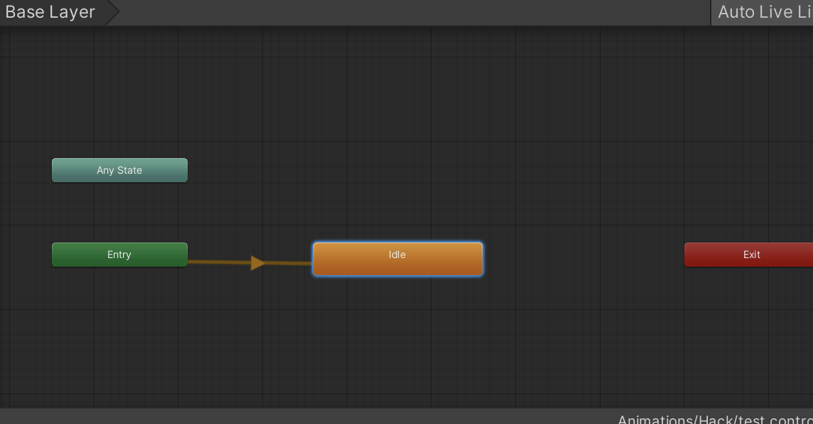
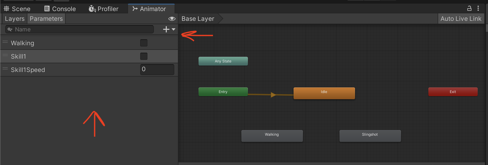
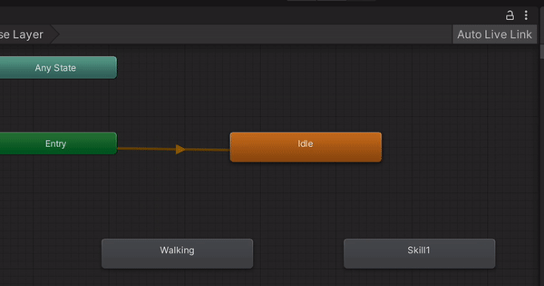

# How to Map the animations to a new character

To add the animations and adjust them to your character, it's simple:

First of all, if your animations are inside a model (character model) copy them and create a new folder for your respective character inside of the `Assets/Animations` folder.

When you have all your animations in the folder, check one by one if they had the field loop time checked or not. This depends on whether you want the animation to be looped or not. A good example of loop animations are Walking and Idle.

Now make sure you have an AnimatorController for your character, if not, create one through Unity's top bar:
`Assets > Create > AnimatorController` renamed and move it to the `Assets/Animations` folder.

When you have all your animations set, open the AnimatorController and drag the entry animation (Idle in our case) it will automatically connect it to the entry state.

Then drag and drop the rest of the animations into the animator. Now we are ready to create the transitions 🤙.

Take into account what we learned in the [Parameters docs](./animations.md) and create the respective parameters for each skill, in my case are `Walking`, `Skill1`, and `Skill1Speed`.

Now create the transitions between states

Select the transition, add the parameters' conditions, and tweak the transition config with what you need ( Transition duration, Has Exit Time, etc), taking into account what we learned in [Transitions](./animations.md).

Bear in mind to tweak the values of `executeAnimationDuration`, `startAnimationDuration`, and `animationSpeedMultiplier` in the respective Scriptable Object of the skill.

To use the `animationSpeedMultiplier`, set to use the Multiplier parameter checkbox in the speed section of the animation.
