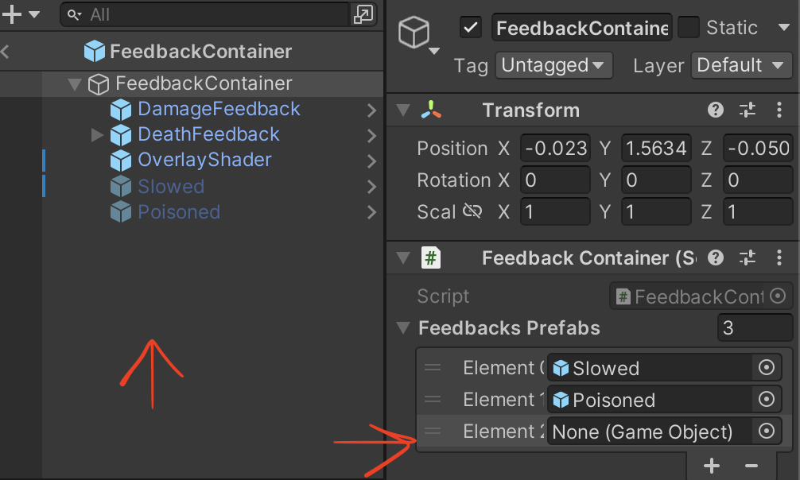

# How to create a new feedback for State Effects
☝️🤓 Assuming we already have the feedback implemented in the backend

1. First, create the new Feedback prefab with the particle system you want, then add it to the `Client/Assets/Feedbacks/States` folder.

3. Inside the `FeedbackContainer` prefab you have to add the new prefab as a child and then add it to the list in the script component.



4. In the `Battle.cs` script there is an Enum called `StateEffects` which only contains the states effects from the backend (Because we don't want the others effects such as rage, disarm, etc), you have to add the effect you want to display and match it with the `PlayerEffect` enum that comes from the backend.
``` 
    private enum StateEffects
    {
        Poisoned = PlayerEffect.Poisoned,
        Slowed = PlayerEffect.Slowed,
        Freeze = PlayerEffect.Freeze, // New effect added, with the same value as the backend version
    }
```
 We store only these states to simplify the search iterations in the `ManageFeedbacks` method.

4. And now you are ready to go! Test it and enjoy the new feedback.🤩
